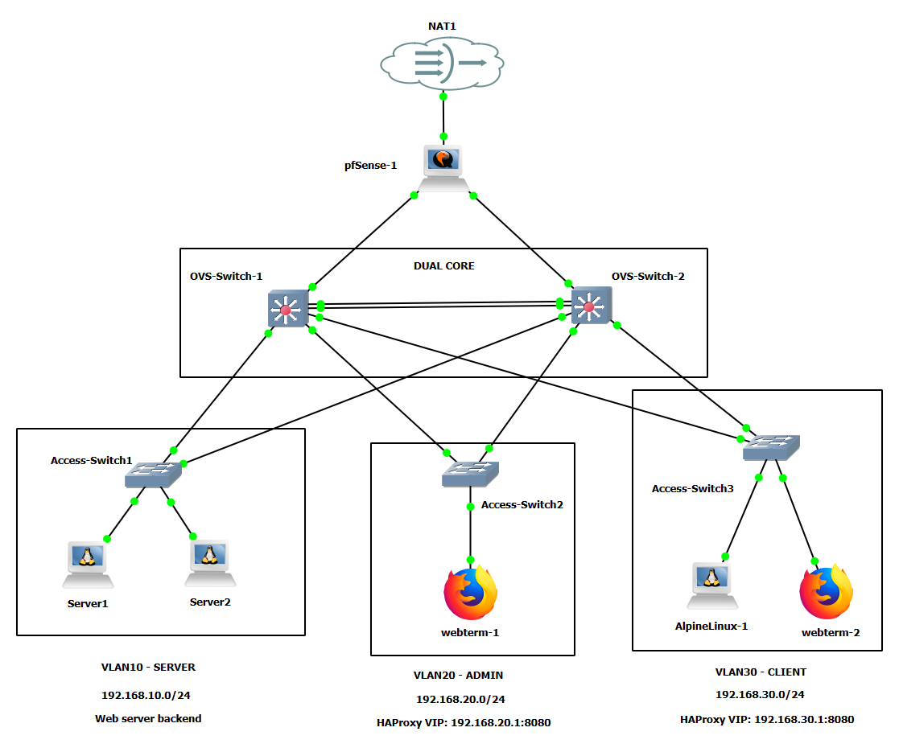

# enterprise-network-security-lab
Created by GNS3
# 🛡️ Enterprise Multi-VLAN Network & Security Lab

โครงการจำลองสถาปัตยกรรมระบบเครือข่ายและระบบความปลอดภัยระดับองค์กร (Enterprise Infrastructure Security) บน **GNS3** เน้นการออกแบบโครงสร้างแบบ **High Availability (Redundancy)**, **Inter-VLAN Routing**, **Traffic Management (HAProxy Load Balancing)** และ **Gateway Security**

## ต้องใช้อะไรบ้าง : GNS3, VMware, ไฟล์ image ของ pfsense
พวก config ต่างๆ ในแต่ละอุปกรณ์ ให้ copy&paste จากไฟล์ .conf โดยนำไปใส่ในช่อง *edit config* ของอุปกรณ์ทุกตัวก่อนที่จะ start

rule , firewall อะไรต่างๆของ pfsense ให้เข้าไปที่ **Diagnostics -> Backups & Restore** แล้ว import ไฟล์ .xml

ปล. pfsense webgui ไม่ได้เปลี่ยน username และ password
---

## 📐 Network Architecture Diagram



### 🏗️ Network Design Highlights
* **Edge Firewall & Gateway:** **pfSense-1** ทำหน้าที่เป็น Stateful Firewall, Inter-VLAN Router, NAT Gateway ออกสู่อินเทอร์เน็ต และเป็น **DHCP Server**
* **Core Layer Redundancy (Dual OVS):** ใช้ **Open vSwitch (OVS)** 2 ตัวทำงานร่วมกันในรูปแบบ Dual Core
  * **Spanning Tree Protocol (STP):** ป้องกัน Loop โดยกำหนดให้ `OVS-Switch-1` เป็น Primary Root Bridge (`0x1000`) และ `OVS-Switch-2` เป็น Backup Root Bridge (`0x2000`)
  * **LACP Link Aggregation:** ทำ LACP Bond (`eth1` + `eth5`) เชื่อมต่อระหว่าง OVS1 และ OVS2 เพื่อเพิ่ม Bandwidth และรองรับ Fault Tolerance
* **Access Layer:** สเกลพอร์ตผ่าน Access Switches แยกตาม VLAN
* **Load Balancing (HAProxy):** กำหนด Virtual IP (VIP) กระจาย Traffic จาก Client ไปยัง Backend Web Servers

---

## 🌐 IP Addressing & Subnet Strategy

| VLAN Name | Subnet | Gateway | IP Allocation Type | DHCP Scope / Host IP | Description |
| :--- | :--- | :--- | :--- | :--- | :--- |
| **VLAN10 (SERVER)** | `192.168.10.0/24` | `192.168.10.1` | Static Only | `192.168.10.101 - .102` | Backend Web Servers (No DHCP for Security) |
| **VLAN20 (ADMIN)** | `192.168.20.0/24` | `192.168.20.1` | Dynamic (DHCP) | `192.168.20.100 - .200` | Admin Workstations / HAProxy VIP: `192.168.20.1:8080` |
| **VLAN30 (CLIENT)** | `192.168.30.0/24` | `192.168.30.1` | Dynamic (DHCP) | `192.168.30.100 - .200` | End-User Workstations / HAProxy VIP: `192.168.30.1:8080` |

---

## 📁 Repository Directory Structure

```text
enterprise-network-lab/
├── README.md                      # Documentation หน้าหลัก
├── docs/
│   └── topology-diagram.png       # แผนผังเครือข่าย GNS3 Topology
└── configs/
    ├── routers-firewalls/
    │   └── pfsense-config.xml        # pfSense Complete Configuration Backup
    ├── switches/
    │   ├── ovs1-core-primary.conf    # OVS-Switch-1 Configuration (STP Priority 0x1000)
    │   └── ovs2-core-backup.conf     # OVS-Switch-2 Configuration (STP Priority 0x2000)
    └── servers-clients/
        ├── backend-server.conf       # Ubuntu Web Server Static IP + Auto-deploy Script
        └── dhcp-client.conf          # Generic DHCP Client Configuration (Alpine / Webterm ทั้งของ Admin และ CLient)
